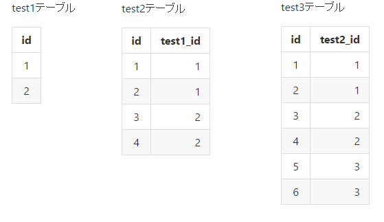

# MyBatisマニュアル

## 最初に導入するべきPlugin
* MyBatipse

### インストール方法
eclipseを起動して、ヘルプ > Eclipseマーケットプレイス > MyBatipse 選択してインストール

### 出来るようになること
すごく簡単にいうと、eclipseのjavaエディタを操作している感覚で、MyBatisのマッパーXMLが操作出来るようになります。

例：

* 充実したタグ補完、タグ内の属性補完機能
* resultMapに値を入力する際にctrl+spaceで使用可能な設定が補完で指定できる
* resultMapに設定されている値をCtrl押しながらクリックすると、定義されている場所にジャンプする
* selectタグ等のidをctrl押しながらクリックすると、対応するJava側のマッパーファイルにジャンプできる
* 構文チェックの実施

等

### 参考サイト
http://qiita.com/YAKINIKU/items/9d7886a456e533555f80

## マッピングの基本(一番シンプルで一番力技)

難しく感じがちですが、基本的な思想は至極シンプルです。  
columnで指定したSQLのカラムが、propetyで指定したjavaのプロパティにバインドされるだけです。  
ここでは下記のテーブルの構成をすべて結合し、その結果が欲しい場合をサンプルに考えます。  
※SQLの実行結果の1行につき1DTOインスタンスが生成されるパターン。  




```sql
-- 上記のテーブル結合した結果を取得するためのSQL
select
	a.id as aid,
	b.id as bid,
	b.test1_id as test1_id,
	c.id as cid,
	c.test2_id as test2_id
from test1 as a
join test2 as b on a.id = b.test1_id
join test3 as c on b.id = c.test2_id
```

### 手順
以下の要領でマッパーxmlに設定を記載していきます。

* (1) selectタグ内に使用するSQLを書く(ここで使用するタグは用途に応じて、update.delete等)
* (2) javaで呼び出すためのメソッド名を指定(メソッド名は、マッパーxmlの拡張子を .java にしたファイル中に記載する)
* (3) SQLの実行結果をバインドするための定義が書かれているresultMapを指定
* (4) SQLを実行した結果のバインド先のJavaクラスの指定
* (5) SQLのどのカラムをマッピングするかの指定
* (6) (5)で指定したカラムを(4)で指定したJavaクラス(サンプルだとTest1Test2Dto3)の、どのプロパティにバインドするかの指定

で、(5)～(6)をSQLのカラム数だけ繰り返すだけ。

<a name="力技_重要注意事項"></a>
***重要注意事項***  
各テーブルのidにSQLで別名を定義していることに注目してください。  
なぜこうしているかと、idというカラム名が被っている状態だと、バインド時に  
column:id → property:aid  
column:id → property:bid  
column:id → property:cid  
のどれを使うかが正しく行われなくなるからです。  
上手く動いてる事もありますが、カラム名は一意にすることを推奨します。  
レコードの更新日、作成日のカラム（例：updateAt, createAt）等は基本的に全てのテーブルに存在していると思いますが、  
SQL上では一意になるようにしてください。

```xml
<!-- Test1Mapper.xml (マッパーxmlファイル) -->

	<select --(1)
		id="selectTest1Test2e" --(2)
		resultMap="selectTest1Test2e" --(3)
	>
		select
		a.id as aid, --(5)で指定されるカラム名
		b.id as bid,
		b.test1_id as test1_id,
		c.id as cid,
		c.test2_id as test2_id
		from test1 as a
		join test2 as b on a.id = b.test1_id
		join test3 as c on b.id = c.test2_id
	</select>

	<resultMap
		id="selectTest1Test2e" --(3)で指定されるresultMap名の定義
		type="Test1Test2Dto3" --(4)
	>
		<result
			column="aid" --(5)
			jdbcType="INTEGER"
			property="aid" --(6)
		 />

		<result column="bid" jdbcType="INTEGER" property="bid" />
		<result column="test1_id" jdbcType="INTEGER" property="test1Id" />

		<result column="cid" jdbcType="INTEGER" property="cid" />
		<result column="test2_id" jdbcType="INTEGER" property="test2Id" />
	</resultMap>
```
```java
//マッパーの結果を受け取るjavaのDto
//settger,getterは省略
public class Test1Test2Dto3 { --(4)で指定されるJavaクラスの定義

	protected Integer aid; --(6)で指定されるプロパティ名の定義
	protected Integer bid;
	protected Integer test1Id;
	protected Integer cid;
	protected Integer test2Id;
}
```

### Tips
#### ・resultタグの中身の書き方が分からないんだけど。。
自動生成されたやつをコピペして使ってください。  
テーブル毎に生成されているマッパーxmlの一番上に、BaseResultMapという名前の定義があります。  
これはMyBatisGeneratorで自動生成されたものですが、コピペでそのまま使えます。  
※columnや、propertyの名前は実際に使用するSQL、プロパティ名に合わせること  
※ちなみに、、resultのjdbcTyepeは無くても基本動作すると思います。  

```xml
<!-- こういうのが一番上にいます-->
  <resultMap id="BaseResultMap" type="test3.db.entity.Test1">
    <!--
      WARNING - @mbg.generated
      This element is automatically generated by MyBatis Generator, do not modify.
    -->
    <id column="id" jdbcType="INTEGER" property="id" />
    <result column="test1_col1" jdbcType="INTEGER" property="test1Col1" />
    <result column="test1_col2" jdbcType="INTEGER" property="test1Col2" />
  </resultMap>
```

#### ・DTOに記載するプロパティの書き方がわからん。。
エンティティクラス(テーブル名.java)が自動生成されているので、それをコピペしてください。  

## マッピングの基本（DTO内でエンティティクラスを使用する）

いちいちコピペしてDTOつくるのめんどくさい。。となると思います。  
この場合、自動生成されるエンティティクラスと、Mybatisのassociateを使ってマッピングします。  
凄くシンプルになります。  
※SQLの実行結果の1行につき1DTOインスタンスが生成されるパターン。  

サンプルとして、Test1Test2Dto2.javaの中で、Test1,2,3用のプロパティをそれぞれ用意し、  
SQLのカラムの先頭に

* a_がついているものは、Test1
* b_がついているものは、Test2
* c_がついているものは、Test3

にバインドするための方法を記載します。  

### 手順
基本的なことは見てもらえばわかると思うので省略します。  

追加で説明したい内容としては下記の通り。

**autoMapping**  
SQLに記載されているカラム名を見て、同名のJavaプロパティに自動でマッピングしてくれる機能です。  
  
**columnPrefix**  
カラム名の先頭を見て、どのバインド定義を使うかを判定することできる機能です。  
サンプルではSQLの中で、

* test1テーブルのカラムにはa_
* test2テーブルのカラムにはb_
* test3テーブルのカラムにはc_

をそれぞれ付与しています。  

[こちら](#力技_重要注意事項)でも記載しましたが、  
複数テーブルで同じカラム名のものが存在する場合に、バインドがおかしくなるのを回避することができます。  
また、columnで指定するカラム名を実際のカラム名のまま使用することができます。  
※サンプルだとautoMappingでカラム名を全て解決しているので、分かり辛いですが、、  


```xml
<!-- Test1Mapper.xml (マッパーxmlファイル) -->

	<select
		id="selectTest1Test2b"
		resultMap="test1test2Map2"
	>
		select
		a.id as a_id,
		b.id as b_id,
		b.test1_id as b_test1_id,
		c.id as c_id,
		c.test2_id as c_test2_id
		from test1 as a
		join test2 as b on a.id = b.test1_id
		join test3 as c on b.id = c.test2_id
	</select>

	<resultMap id="test1test2Map2" type="Test1Test2Dto2" autoMapping="true">
		<association autoMapping="true" columnPrefix="a_" javaType="Test1" property="test1" />
		<association autoMapping="true" columnPrefix="b_" javaType="Test2" property="test2" />
		<association autoMapping="true" columnPrefix="c_" javaType="Test3" property="test3" />
	</resultMap>

```

```java
//settger,getterは省略
public class Test1Test2Dto2 {

	protected Test1 test1;
	protected Test2 test2;
	protected Test3 test3;
}
```

### Tips

#### 別マッパーファイルにある定義を使いたいんだけど。。

使えます。  
サンプルでは association 内の resultMap の指定に別ネームスペースの定義を使用しています。  
ちなみに、MyBatipseを入れていれば、ctrl+spaceで補完可能です。  

```xml
	<resultMap id="test1test2Map2" type="Test1Test2Dto2" autoMapping="true">
		<association columnPrefix="b_" javaType="Test2" property="test2" resultMap="test3.db.mapper.Test2Mapper.BaseResultMap" />
	</resultMap>
```

ただし、この指定方法を使った場合、参照先の定義しか見なくなるようなので注意  
※hogehogeに新しくresultタグを書いたりしても無視される。  

```xml
	<resultMap id="test1test2Map2" type="Test1Test2Dto2" autoMapping="true">
		<association columnPrefix="b_" javaType="Test2" property="test2" resultMap="test3.db.mapper.Test2Mapper.BaseResultMap" >
			～hogehoge～
		</association>
	</resultMap>
```

## マッピングの応用(1行1DTOではなく、重複部分をコレクションにする)

### 手順

バインドされた結果が下記の構成になるようにマッピングする。  
説明しづらいので見てわかる人だけ頑張る。  

Test1  
　+Test2のリスト  
　　+Test3のリスト  

```xml
<!-- Test1Mapper.xml (マッパーxmlファイル) -->

	<select id="selectTest1Test2d2" resultMap="selectTest1Test2d2">
		select
		a.id,
		a.test1_col1,
		a.test1_col2,
		b.id as b_id,
		b.test1_id as b_test1_id,
		b.test2_col1 as b_test2_col1,
		b.test2_col2 as b_test2_col2,
		c.id as b_c_id,
		c.test2_id as b_c_test2_id,
		c.enum_test as b_c_enum_test,
		c.update_date as b_c_update_date
		from test1 as a
		join test2 as b on a.id = b.test1_id
		join test3 as c on b.id = c.test2_id
	</select>

	<!-- コレクションの中にコレクションを入れる -->
	<!-- autoMappingを指定するとListの部分がバインドされないため、マッピング部分は自動生成ソースからextendsする -->
	<resultMap extends="BaseResultMap" id="selectTest1Test2d2" type="ForD2Test1Dto">

		<collection columnPrefix="b_" ofType="ForD2Test2Dto" property="test2List" >
			<!-- autoMapping、別ネームスペースのresultMap参照を指定するとListの部分がバインドされないため、仕方ないので自力で書く -->
			<id column="id" jdbcType="INTEGER" property="id" />
			<result column="test1_id" jdbcType="INTEGER" property="test1Id" />

			<collection columnPrefix="c_" ofType="Test3" property="test3List">
				<id column="id" jdbcType="INTEGER" property="id" />
			</collection>
		</collection>
	</resultMap>
```

```java
//settger,getterは省略

//Test1のエンティティを継承して、Test2のコレクション用のフィールドを作る。
public class Test1Dto extends Test1 {

	private List<Test2Dto> test2List;
}

//Test2のエンティティを継承して、Test3のコレクション用のフィールドを作る。
public class Test2Dto extends Test2 {

	private List<Test3> test3List;
}

//Test3はエンティティクラスをそのまま使うので省略
```

